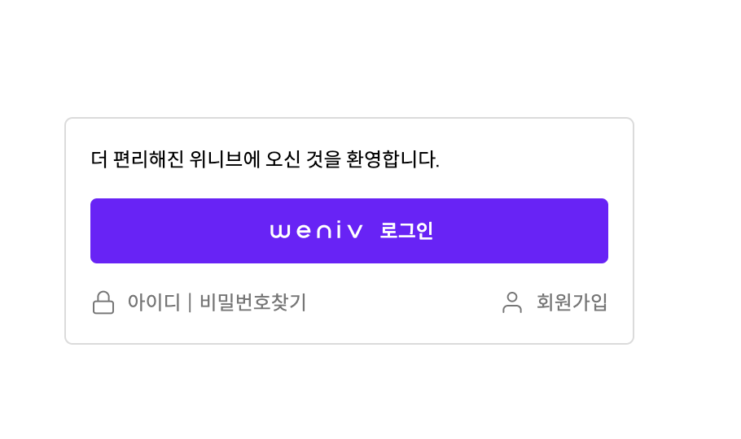

# 멋쟁이 사자처럼 로그인 화면 구현 과제 - 1

## 새로운 시도💡

- 모든 가로배치, 세로배치는 flex를 많이 사용했는데 이번에는 float를 사용하여 로그인 버튼 하단 오른쪽, 왼쪽 요소들을 정렬했다.

## 새로 배운 점💡

- inline-block을 사용했을 때 default로 생겨버리는 여백을 해결하는 방법.
  - 여백은 폰트의 크기와 비례한다. 기본 폰트가 16px이라면 여백은 4px이 생겨버린다. 이를 해결하기 위해 -0.25em 값을 주었다.
    폰트의 종류, 크기가 달라질 때마다 여백의 크기도 달라지기 때문에 절대단위인 px이 아닌 em단위를 사용해 주었다.
- 로그인 버튼 하단 요소들을 float 배치를 했는데 이상하게도 부모가 플로트 된 자식을 인식하고 전체 높이를 제대로 잡았다. 그 이유는 내가 로그인 박스를 화면 정중앙에 정렬하려고 body태그에 적용했던 display: flex 때문이었다. 이로 인해 BFC(Block Formatting Context)영역이 생성되었고, body안의 부모요소는 따로 clear 필요 없이 플로트된 자식까지 챙겨서 전체 높이를 인식할 수 있었던 것이다.
- 로그인 버튼을 처음에 구현할 때 위와 아래 뿐만 아니라 왼쪽, 오른쪽에도 패딩을 줬었다. width와 height를 넣어 구현한건 말할 것도 없고. 근데, 버튼을 a태그로 만들어 `display: block;`을 주었기 때문에 버튼 영역의 너비는 부모의 너비 100%를 쫙 먹게 된다.
  그렇기 때문에 굳이 오른쪽 왼쪽 패딩 값을 주지 않고도 원하는 화면을 구현할 수 있는 것이다.!! 대박이다.. 기본적인 이론인데 제대로 이해를 못하니까 구현하다가 막히는 경험을 하게된다.
- 사소한 텍스트, 큰 의미가 없는 텍스트는 굳이 span태그로 감싸주지 않고 텍스트로만 마크업을 해도 충분하다. css 컨트롤은 부모요소에 해주면 된다.

## 느낀점💡

- flex를 안쓰고도 충분히 레이아웃 배치를 잘 할 수 있구나!
