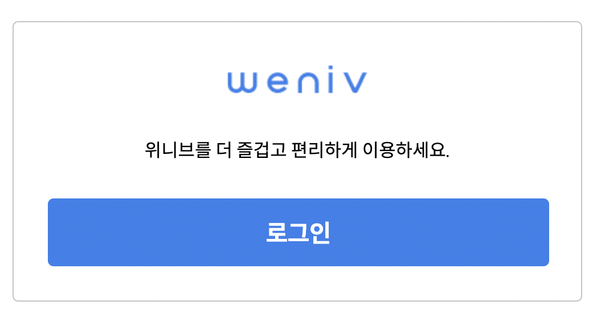
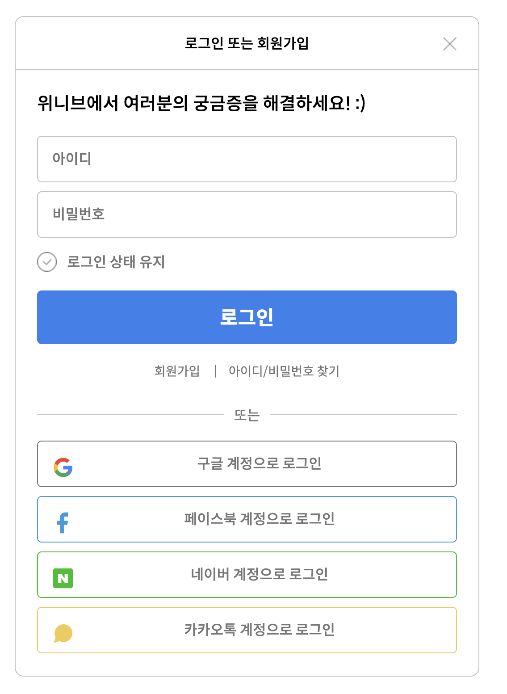

# 로그인 화면 구현 과제 -2

    
    

> ## 새로운 시도💡

- 소셜 링크 이미지들을 개별 이미지로 저장하여 쓴 것이 아니라
  개별 이미지를 한 판에 박아서 이미지 스프라이트 기법을 사용했다.
- 이미지 스프라이트 레티나 기법을 활용하여 물먹은 이미지에서 꺼내주었다. 레티나 기법의 핵심은 원본 사이즈의 x2크기로 받은 이미지를 다시 원본 이미지 판의 규격에 맞게 쭈그러트려 주는 것!
- 스크린리더를 사용하는 분들을 고려한 마크업. 원래 같았으면 모달 창에 있는 X 버튼을 '로그인 또는 회원가입' 마크업 밑에 해줬을 건데, 그렇게 해버리면 탭 키로 눌러가며 스크린리더를 사용하시는 분들이 바로 X 버튼을 만나게 될 수가 있다. 마크업은 맨 마지막에 해주되, position: absolute;를 사용하여 원래 위치로 옮겨 주었다.
- 로그인 상태 유지 체크박스를 input 태그를 사용하여 마크업 해주었다. 처음에 내가 했을 때는 그냥 체크버튼 이미지를 넣고 옆에 텍스트를 마크업해줬는데,, 이것도 접근성인가? 를 고려했을 때 혹은 시맨틱 태그를 고려했을 때 input태그 체크박스 타입을 이용해 주는 것이 훨씬 적절하다. 그리고 체크버튼 이미지를 가상요소를 이용해 label태그에 넣어주었다.
  > ## 새로 배운 점💡
- input태그와 짝인 label태그에 가상요소로 이미지를 넣는 방법을 새로 알게 되었다.
- 같은 요소 선택자가 여러개 있을 때 나는 주로 nth-child()로 원하는 요소를 선택하는 방법을 많이 사용했는데, 형제 콤비네이터를 쓰면 훨씬 더 편하게 쓸 수 있었다! (물론 해당사항이 있는 경우에!)

> ## 느낀 점💡

- css 콤비네이터는 그동안 잘 써오지 않았는데, 적절한 상황에 잘만쓰면 오히려 nth-child나 매번 클래스 네임을 적어줄 필요 없이 간편하게 요소를 선택할 수 있다는 것을 깨달았다. 이미지 넣는 방법도 그렇고,, 나는 개발도 배우기 시작한지 얼마안됐는데 나만의 고집을 가지고 마크업이나 css스타일링을 해왔던 것 같다. 좋은 습관이라면 상관없지만, 안좋은 습관들은 더 굳어지기 전에 고쳐나가야겠다.
