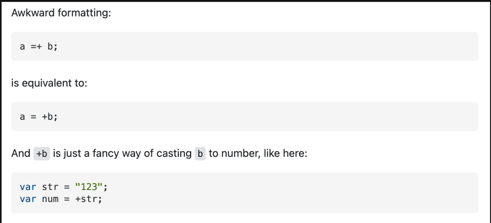

# Day 28. +=와 =+의 차이점

오늘 반복문 배우다가 +=와 =+는 무슨 차이가 있는 지 궁금해졌는데,, 구글링으로 스택오버플로우에서 바로 답을 찾았다..

예를 들어서

```javascript
let a = 2;
let b = 3;
a = a + b; // 5
a += b; // 위와 같은 식이다.
a = +b; // 3, 그냥 단순히 b를 a에 할당하는 거였음,,,
```

반복문안에서 봐서 헷갈린걸까,,

스택오버플로우에서 찾아봤는데, 어색한 형식이라고 한다..

덕분에 확실히 알았다!
