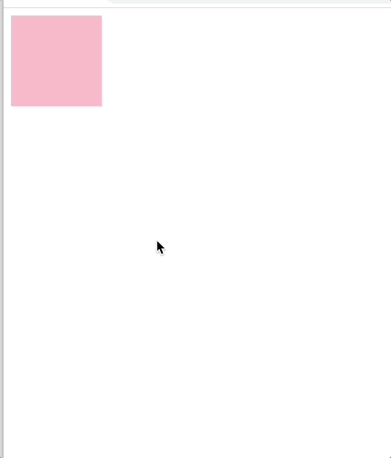

# 웹 최적화를 적용하여 박스 옮기기



```html
<div class="box"></div>
````

```css
.box {
            position: absolute;
            width: 100px;
            height: 100px;
            background-color: pink;
}
```

```javascript
const box = document.querySelector('.box');
        let pos = 0;
        let pos1 = 0;
        window.addEventListener('keydown', (event) => {
            if(event.keyCode == 39) {
                pos += 5;
                box.style.transform = `translateX(${pos}px)`;
            } else if(event.keyCode == 37) {
                pos -= 5;
                box.style.transform = `translateX(${pos}px)`;
            }
})
```

position 속성을 이용해서 박스를 옮길 수도 있지만, position 속성은 리페인트를 계속 일어나게 해서 웹 성능을 저하시킨다.
따라서 이번 실습에는 transform 속성을 사용했다.